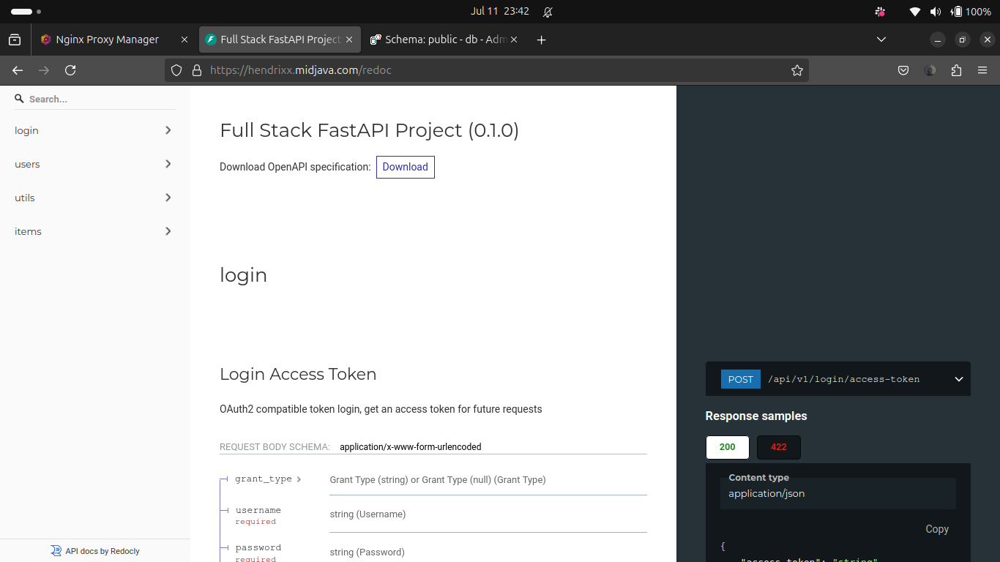

# Full-Stack FastAPI and React Template

Welcome to the Full-Stack FastAPI and React template repository. This repository serves as a demo application for interns, showcasing how to set up and run a full-stack application with a FastAPI backend and a ReactJS frontend using ChakraUI.

## Project Structure

The repository is organized into two main directories:

- **frontend**: Contains the ReactJS application.
- **backend**: Contains the FastAPI application and PostgreSQL database integration.

Each directory has its own README file with detailed instructions specific to that part of the application.

## Getting Started

To get started with this template, please follow the instructions in the respective directories:

- [Frontend README](./frontend/README.md)
- [Backend README](./backend/README.md)


## How to spin up the application locally before dockerizing

- cloned the the repository containing the project file
- there are two directorys:
  - frontend - a nodejs application
  - backend - a fast api which will serve the front
- change directory into the respective directory and install thier respective dependencies

  - _**cd frontend**_
  ```sh
     # intall nodejs and node package manager
    sudo apt update
    sudo apt install nodejs
    sudo apt install npm
   ```
   ```sh
    # intall dependencies
    npm install
   ```
   ```sh
    # lets spin up our frontend db
    npm run dev -- --host
   ```
   ```sh
   # you can now access your front application at localhost:5173 on your browser.
   ```


  - _**cd backend**_
   ```sh
    # poetry to install dependencies
    pip poetry install
   ```
   ```sh
    # you would be require to add to app if not already added
     export PATH="$HOME/.poetry/bin:$PATH"
   ```
   ```sh
    poetry install
   ```
   ```sh
   # before runing this, we will set up a pg database
    poetry run bash ./prestart.sh
   ```
   ```sh
   # login to our db
    sudo -u postgres psql

    # create a role
    CREATE ROLE hng WITH LOGIN PASSWORD 'devops';

    # we want our role to have createdb privileges
    ALTER ROLE hng WITH CREATEDB;

    # Set role hbg and then create a db
    SET ROLE hng;
    CREATE DATABASE devopseng;

    # grant 
   ```
   ```sh
   # update your backend .env file with the pg details
   # this CMD will call several scripts to initialize the project environment and Create a db connection
   poetry run bash ./prestart.sh
   ```
   ```sh
   # now lets spin up our server
   poetry run uvicorn app.main:app --reload

   # you can now go to your browser at `localhost:8000` to access your backend
   ```
- create a postgres database and grant to it the necessary privileges so that the backend will connect to it when spinning up the server which we have done above

## Spining a dockerized application
- we gonna write dockerfiles for each of the application
  -  for the backend
    ```sh
    # Official image
    FROM python:3.12-slim

    # Install poetry
    RUN pip install poetry

    # Working directory in the container
    WORKDIR /app

    # Copies the current directory contents into the container at /app
    COPY . .

    # Make sure the prestart script is executable
    RUN chmod +x ./prestart.sh

    # Install any needed packages specified in pyproject.toml
    RUN poetry install

    ENV PYTHONPATH=/app  

    # Make port available outside this container
    EXPOSE 8000

    # Start the application
    CMD ["bash", "-c", "poetry run ./prestart.sh && poetry run uvicorn app.main:app --proxy-headers  --host 0.0.0.0 --port 8000 --reload"]
    ```

  - for the frontend
    ```sh
    # Use an official Node runtime as a parent imag
    FROM node:latest

    # Set the working directory
    WORKDIR /app

    # Copy the application files
    COPY . .

    # Install dependencies
    RUN npm install

    # Expose the port the development server runs on
    EXPOSE 5173

    # Run the development server
    CMD ["npm", "run", "dev", "--", "--host"]
    ```

- Then a docker-compose.yml file spinup the containers: frontend and backend
    ```sh

    version: '3.8'

    services:
      backend:
        build:
          context: ./backend
        container_name: fast_app
        ports:
          - "8000:8000"
        depends_on:
          db:
            condition: service_healthy
        env_file:
          - ./backend/.env

      frontend:
        build:
          context: ./frontend
        container_name: node_app
        ports:
          - "5173:5173"
        env_file:
          - ./frontend/.env

        db:
          image: postgres:latest
          container_name: postgress-db
          ports:
            - "5433:5432"
          volumes:
            - postgres_data:/var/lib/postgresql/data
          env_file:
            - ./backend/.env
          healthcheck:
            test: ["CMD-SHELL", "pg_isready -h localhost -p 5432 -U hendrixx -d hng"]
            interval: 5s
            timeout: 5s
            retries: 5

      nginx-proxy-manager:
        image: jc21/nginx-proxy-manager:latest
        container_name: proxy_manager
        restart: always
        ports:
          - "80:80"
          - "443:443"
          - "8090:8090"  # Proxy Manager GUI
        environment:
          DB_SQLITE_FILE: "/data/database.sqlite"
        volumes:
          - ./nginx/data:/data
          - ./nginx/letsencrypt:/etc/letsencrypt
        depends_on:
          - db
          - backend
          - frontend
          - adminer

      adminer:
        image: adminer
        container_name: adminer
        ports:
          - "8080:8080"

    volumes:
      postgres_data:
      data:
      letsencrypt:
    ```
### Docker Compose Configuration Summary

The docker-compose file above defines a multi-container application setup with the following services:

### Services
#### Backend
- Built from `./backend` directory
- Container name: `fast_app`
- Exposed on port 8000
- Depends on the `db` service
- Uses environment variables from `./backend/.env`

#### Frontend
- Built from `./frontend` directory
- Container name: `node_app`
- Exposed on port 5173
- Uses environment variables from `./frontend/.env`

#### Database (db)
- Uses PostgreSQL latest image
- Container name: `postgress-db`
- Exposed on port 5433 (mapped to internal 5432)
- Data persisted in `postgres_data` volume
- Uses environment variables from `./backend/.env`
- Includes a healthcheck to ensure database availability

#### Nginx Proxy Manager
- Uses `jc21/nginx-proxy-manager:latest` image
- Container name: `proxy_manager`
- Exposes ports 80, 443, and 8090 (for GUI)
- Uses SQLite for its database
- Mounts volumes for data and SSL certificates
- Depends on db, backend, frontend, and adminer services

#### Adminer
- Uses the `adminer` image
- Container name: `adminer`
- Exposed on port 8080

### Volumes
- `postgres_data`: For persisting PostgreSQL data
- `data`: For Nginx Proxy Manager data
- `letsencrypt`: For SSL certificates

This setup provides a complete environment with a backend API, frontend application, database, reverse proxy, and database management tool, all containerized and ready for deployment.

`sudo docker-compose up ---build` to build and spin up the containers.

<hr>

On my browser, I caaccess the proxy manager on `localhost:8090` for our domain routing.

the default login credentials are:
  - `email:admin@example.com`
  - `password: changeme` 

  
you are required to change this details.

here we would configure our routes to the following domains:


- `localhost` opens the frontend page


- `localhost/api` opens the backend api page


- `localhost/docs` opens the api documentation page


- `localhost/redoc` opens the autogenerated api docs


- `proxy.localhost`


- `db.localhost` open the GUI interface for our db with my pg credentials


- logged successfully


## Depoloyin to EC2

- i have an account on aws and have gone ahead to create an EC2 instance: t2.medium, an ubuntu image, with an expanded storage space of 15 from 8GB to accomdate the size of the containers.
- I pushed my repository to github and cloned it on the server from the web shell.
- Then Intalled the needed dependencies
- Recreated a postgres database, see instructions above.

`sudo docker-compose up` to spin up the containers.


you will need to secure domain names. i got mine from `afraid DNS`

we will login to nginx proxy manager:


Then configure our routes to the following subdomains:
- hendrixx.midjava.com - frontend
- hendrixx.midjava.com/api - backend
- hendrixx.midjava.com/docs - api docs
- hendrixx.midjava.com/redoc - autogenerated page
- db.hendrixx.midjava.com - adminer GUI interface
- proxy.midjava.com - Nningx proxy manager

I have mapped my ec2 public ip to the folowind domains above.

Below, i have added 3 proxy hosts:
 - hendrixx.midjava.com
 - db.hendrixx.midjava.com
 - proxy.midjava.com

And 3 redirection host to routes `www` to `non-www`
 - www.hendrixx.midjava.com
 - www.db.hendrixx.midjava.com
 - www.proxy.midjava.com


<hr>

**Lets look at the proxy hosts.**


1. db.hendrixx.midjava.com - Adminer Interface


SSL is ensured and thats why `http` is routed to `https`

2. hendrixx.midjava.com - Frontend


`http` is routed to `https`

<u>customs locations for the backend</u>

- hendrixx.midjava.com/api

  

- hendrixx.midjava.com/docs
  
  

  `http` routed to `https`

- hendrixx.midjava.com/redoc

  

  `http` routed to `https`

3. proxy.midjava.com
    
   We access the proxy manager at its domain, instead of its IP


#### Redirecting `www` to `now-www`

1. www.db.hendrixx.midjava.com


wanna see how the redirection work for `www.db.hendrixx.midjava.com`? [watch the preview here](./img/www_db_hendrixx_midjava_com.mp4)

2. www.hendrixx.midjava.com


wanna see how the redirection work for `www.hendrixx.midjava.com`? [watch the preview here](./img/www_hendrixx_midjava_com.mp4)
